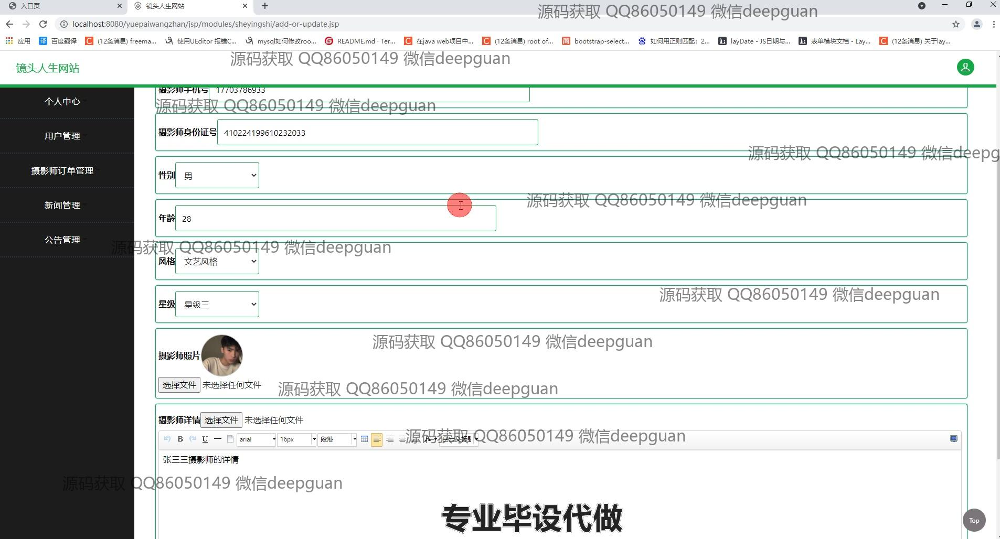
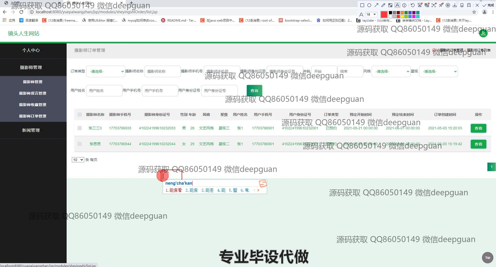
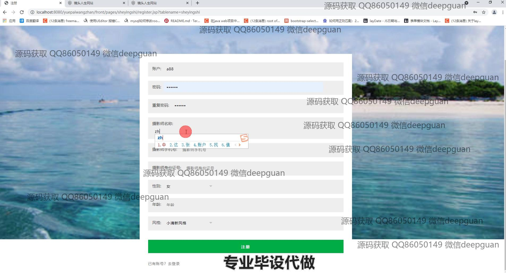

<h1 align="center">“镜头人生”约拍网站的设计与开发</h1>

## 简介
镜头人生约拍网站：角色分为用户和摄影师；功能包括新闻管理、用户管理、摄影师信息录入、订单管理、留言互动和注册登录等。    --计算机毕业设计源码；毕设源码；java毕业设计源码

## 联系方式

<h3 align="center">获取完整代码与数据库文件 + 微信：deepguan QQ: 86050149 QQ群: 783742310</h3>

<h3 align="center">可帮忙远程部署 包运行成功！提供远程部署、修改代码、设计文档指导、代码讲解等服务！</h3>

## 功能介绍（完整见运行截图）
管理员：  
基本功能：登录、注册、退出。网站后台：管理导航栏包括个人中心、轮播图管理、用户管理、摄影师管理、新闻管理、公告管理和基础数据管理。摄影师管理：添加、编辑、删除摄影师信息，包括姓名、性别、年龄、风格、星级和照片上传等。订单管理：查看、筛选和管理摄影师订单及留言互动信息。新闻管理：新闻添加、修改、删除及筛选，支持查看详情和批量操作。公告管理：公告列表展示及详情查看、添加、修改、删除功能。  

用户：  
基本功能：登录、注册、退出。网站首页：导航栏提供首页、新闻、摄影师、我的模块，支持新闻筛选、搜索和详情查看。摄影师信息：浏览摄影师个人资料，包括姓名、性别、风格、星级、联系方式，支持立即预订和留言互动。个人中心：查看和管理个人订单信息，支持填写及编辑预约信息和留言。注册功能：用户和摄影师通过填写基本信息完成账户注册。  

摄影师：  
注册与登录：填写个人信息如姓名、联系方式、风格、年龄、身份证号完成注册及身份验证。个人信息管理：上传和编辑照片，填写星级、风格、详细描述及时间安排。订单管理：查看预约订单及相关用户信息，管理留言内容与互动记录。  

访客：  
网站浏览：通过首页导航栏浏览新闻动态及摄影师列表，筛选风格、星级、联系方式等信息。留言与评论：查看摄影师信息后，可在页面下方留言与摄影师互动。注册与预约：填写基本信息注册用户或摄影师账号，选择摄影师进行在线预约。

## 运行截图

本代码来源于网络,仅供学习参考使用!

